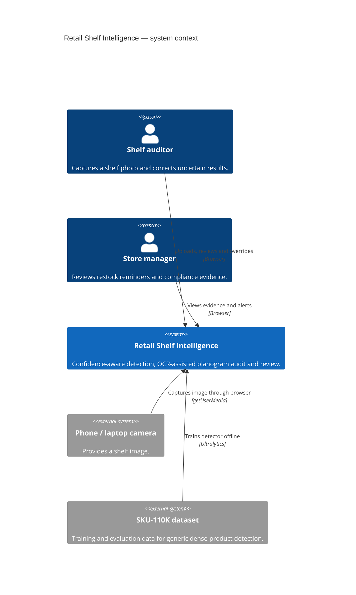
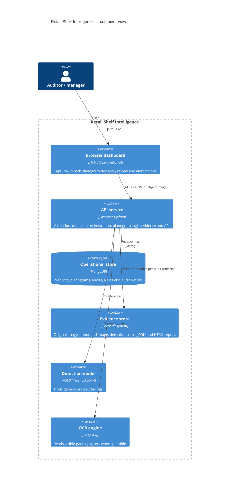
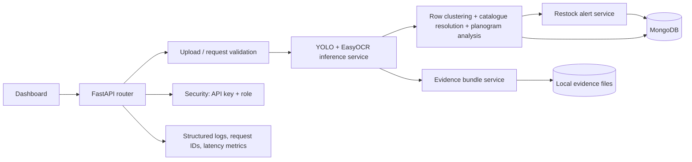

# C4 architecture and data-flow evidence

This is a student-level C4 pack mapped to the actual implementation. It does
not claim cloud systems that have not been deployed.

## C1 — System context



## C2 — Containers



## C3 — API component view



## Audit sequence and state

```mermaid
sequenceDiagram
    actor Auditor
    participant UI as Dashboard
    participant API as FastAPI
    participant AI as YOLO + OCR
    participant DB as MongoDB
    participant Files as Evidence folder
    Auditor->>UI: Capture or upload shelf image
    UI->>API: POST /api/v1/audits
    API->>API: Validate content type, size and decoded pixels
    API->>DB: Read product catalogue + active planogram
    API->>AI: Detect boxes and attempt OCR
    AI-->>API: boxes, confidences and OCR text
    API->>API: Cluster rows; count resolved SKUs; compare slots
    API->>Files: Save source, annotated image, crops, JSON, HTML report
    API->>DB: Save audit + audit_created event + alerts
    API-->>UI: Annotated image, results and review queue
    Auditor->>UI: Correct or remove uncertain detection
    UI->>API: POST /audits/{id}/overrides
    API->>DB: Save override event and recalculate analysis/alerts
```

## Deployment boundary

The prototype runs on one local machine through Docker Compose or the documented
virtual environment. MongoDB and the FastAPI service are separate containers in
`docker-compose.yml`; model weights and evidence folders are mounted volumes. A
later edge deployment can use the same FastAPI API with a local model volume. A
production deployment needs TLS, OAuth, a managed object store and a shared
rate limiter.
