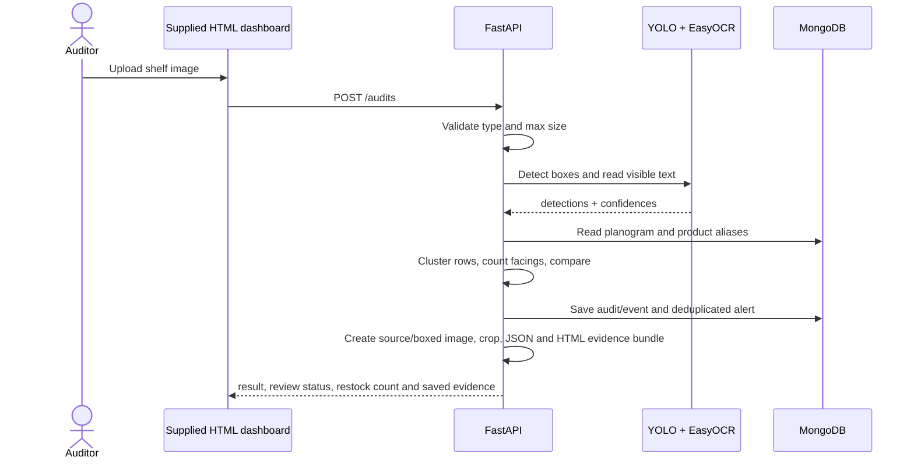

# Solution design pack

This document is the concise architecture evidence to place in the field-project portfolio. The source of truth for precise request/response contracts is the generated FastAPI page at `/docs`.

## Stakeholders and scope

| Stakeholder | Need | System response |
| --- | --- | --- |
| Shelf auditor | Fast repeatable count and a way to fix AI mistakes | Mobile-friendly upload, boxed result, crop evidence and dashboard review queue |
| Store manager | Know what needs refilling | Open restock-alert feed with acknowledgement/resolution |
| Merchandiser | Check required facings and placement | Store/shelf planogram with rows, expected and minimum facings |
| Project team | Reproduce evidence for assessment | Seeded experiment configuration, audit events, Docker setup and model card |

In scope: one shelf image per audit, dense generic-product detection, product aliases, facing comparison, alerts and review trail. Out of scope: automatic ordering, price checking, face recognition, customer analytics, live CCTV and automatic disciplinary actions.

## Container and data-flow design

## MongoDB data dictionary

| Collection | Key fields | Why it exists |
| --- | --- | --- |
| `products` | `sku`, `name`, `ocr_aliases` | Links packaging text to a local product identity. `_id` is the SKU. |
| `planograms` | `store_id`, `shelf_id`, `slots[row, sku, expected_facings, minimum_facings]` | Defines what a shelf should contain. |
| `audits` | source/annotated image URLs, evidence URLs, immutable planogram snapshot, detections, analysis, timings, status | Evidence of each AI decision at the time it was made. |
| `alerts` | alert key, row, SKU, observed/minimum facings, status | Small restock-reminder queue, deduplicated while open. |
| `audit_events` | audit ID, actor, event type, timestamp, details | Human override and alert-action audit trail. |

The current prototype stores images locally under `data/uploads`; use a permission-cleared object store with encryption and retention rules before deploying outside a classroom.

Each new audit additionally has a server-generated folder under
`data/audit_artifacts/<audit-id>` containing the input, boxed visualisation,
individual crops, JSON and printable report. MongoDB remains the source of
truth; evidence artifacts make assessor review practical.

## API contracts and status handling

| Endpoint | Caller | Main failure controls |
| --- | --- | --- |
| `POST /api/v1/products` | Auditor/admin | duplicate SKU → 409; role check |
| `PUT /api/v1/planograms/{store}/{shelf}` | Auditor/admin | mismatched IDs or min > expected → 400/422 |
| `POST /api/v1/audits` | Auditor | image extension, empty file and 10 MB checks; no trained weights → 503 |
| `POST /api/v1/audits/{id}/overrides` | Auditor | records who corrected/removed an AI detection |
| `GET /api/v1/alerts` | Manager | lists only open alerts by default |
| `POST /api/v1/alerts/{id}/action` | Auditor/admin | acknowledgement/resolution written to event trail |
| `GET /api/v1/health`, `/metrics` | Demonstrator | model/database status and compact latency/request metrics |

The `X-User-Role` guard separates view and change actions in this prototype. Set an `API_KEY` outside version control for a deployed demo. For production, replace shared-key/header identity with university/organisation OAuth and server-side roles.

## Threat and misuse summary

| Risk or misuse | Control now | Follow-up before real store deployment |
| --- | --- | --- |
| Oversize or non-image upload | extension, content-type, byte-size, decoded image and pixel dimension validation | add malware scanning |
| Secret committed to Git | `.env` ignored; example has no secret | use a secret manager and key rotation |
| False restock claim | detection confidence, conservative OCR matching, review flag and manual override | calibrate thresholds against local ground truth |
| Personal/store-sensitive imagery | no sample images committed; permission warning | written permission, retention schedule, access logs |
| Alert fatigue | alert key deduplicates until resolved; a successful re-check closes stale alerts | manager notification preferences/escalation policy |

The prototype adds an in-memory per-client audit-upload rate limit. It is
appropriate for a one-machine class demo only; move it to Redis or an API
gateway before horizontal deployment.

## Prioritised backlog

| Priority | User story | Acceptance criterion |
| --- | --- | --- |
| Must | As an auditor, I upload a shelf image and receive detection/facing results. | Valid image produces saved audit; missing weights returns a clear 503. |
| Must | As a manager, I see an alert when confirmed facings are below a configured minimum. | One open alert per shelf/row/SKU until resolved. |
| Must | As an auditor, I correct an uncertain SKU rather than accepting a guess. | Override changes analysis and appears in `audit_events`. |
| Should | As a merchandiser, I compare a captured shelf against a stored planogram. | Mismatch list shows expected, observed, shortfall and row. |
| Could | As a manager, I receive an e-mail/WhatsApp reminder. | Add only after explicit recipient consent and an approved connector. |

## Individual contribution evidence template

Do not manufacture this evidence. Each partner should maintain their own completed issue cards and commits.

| Student | Owned module | Evidence to attach |
| --- | --- | --- |
| Partner A | Dashboard/API integration | issue link, UI screenshots, tests, review comments |
| Partner B | Training/evaluation and data pipeline | notebook/run summary, metrics, annotation audit, model card |
| Both | Demo, robustness tests, report | dated test sheets, 5–8 minute video, individual reflection |
